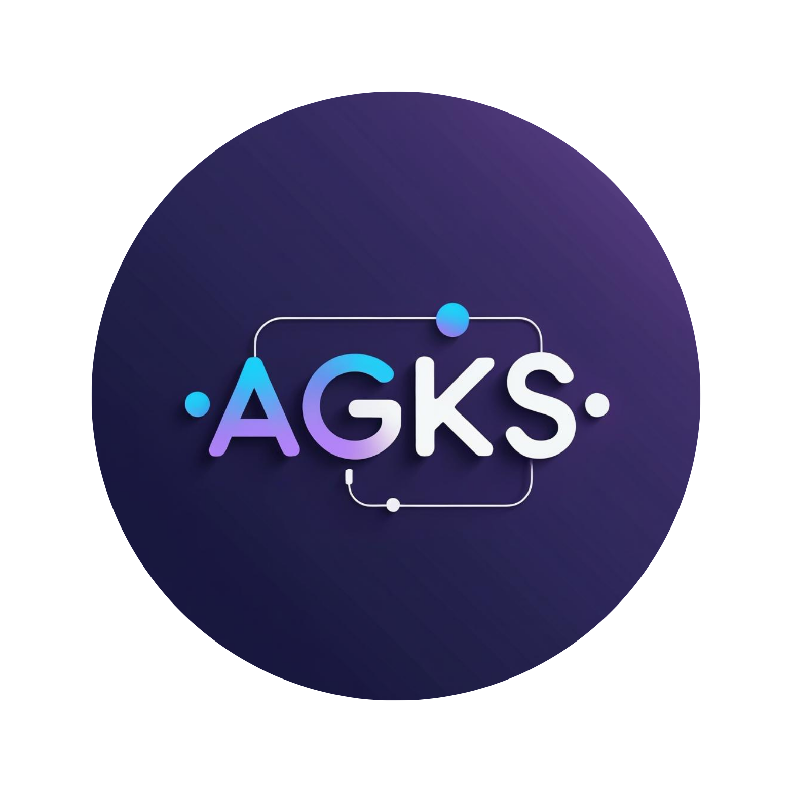

# AGKS - Akıllı Gözetim Koruma Sistemi 🛡️

<div align="center">



### Yapay Zeka Destekli Güvenlik İzleme Sistemi
*AI-Powered Intelligent Surveillance Protection System*

[](https://github.com/SamiAwawda/Security-Sentinel-AI)
[](https://python.org)
[](https://flask.palletsprojects.com)
[](https://ultralytics.com)
[](LICENSE)

</div>

---

## 📋 Table of Contents

- [Overview](#-overview)
- [Features](#-features)
- [Technology Stack](#-technology-stack)
- [Project Structure](#-project-structure)
- [Installation](#-installation)
- [Configuration](#-configuration)
- [Usage](#-usage)
- [API Endpoints](#-api-endpoints)
- [Database Schema](#-database-schema)
- [Screenshots](#-screenshots)
- [Version History](#-version-history)
- [Contributing](#-contributing)
- [Author](#-author)
- [License](#-license)

---

## 🎯 Overview

**AGKS (Akıllı Gözetim Koruma Sistemi)** is an advanced real-time security surveillance system powered by artificial intelligence. The system uses YOLOv8 deep learning model to detect potential threats such as weapons, masked individuals, and other dangerous objects in live camera feeds.

### What Makes AGKS Special?

| Feature | Description |
|---------|-------------|
| 🧠 **AI-Powered** | YOLOv8 deep learning for accurate threat detection |
| 📹 **Forensic Recording** | Pre-event + post-event video capture with annotations |
| 📱 **Instant Alerts** | Real-time Telegram notifications with photo evidence |
| 💾 **Persistent Storage** | SQLite database for complete alert history |
| 🎨 **Modern UI** | Glassmorphism design with dark theme |

---

## ✨ Features

### 🎯 Core Capabilities

- **Real-Time Threat Detection**
  - YOLOv8 deep learning model
  - 6 custom-trained detection classes
  - Sub-second inference speed

- **Forensic Video Recording**
  - Ring buffer for pre-event capture (5 seconds before)
  - Post-event recording (5 seconds after)
  - Videos saved with bounding box annotations

- **Instant Telegram Notifications**
  - Photo alerts with threat snapshots
  - Timestamp and threat details
  - Remote monitoring capability

- **SQLite Database**
  - Persistent alert storage
  - Complete threat history
  - Statistics and analytics

### 🔍 Detection Classes

| Class | Description | Threat Level |
|-------|-------------|--------------|
| 🎭 **Balaclava** | Masked face detection | 🔴 HIGH |
| 🔫 **Gun** | Firearm detection | 🔴 HIGH |
| 🔪 **Knife** | Blade weapon detection | 🔴 HIGH |
| 👤 **Person** | Human detection | ⚪ INFO |
| 📱 **Phone** | Mobile phone detection | 🟡 MEDIUM |
| 💵 **Money** | Cash detection | 🟡 MEDIUM |

### ⚠️ Threat Logic Rules

```
Balaclava (Masked Person)  → ALWAYS THREAT (Immediate Alert)
Person + Gun               → ARMED PERSON (Immediate Alert)
Person + Knife             → PERSON WITH WEAPON (Immediate Alert)
Gun (alone)                → NO THREAT (Requires person)
Knife (alone)              → NO THREAT (Requires person)
Person (alone)             → NO THREAT (Normal)
```

---

## 🛠 Technology Stack

<div align="center">

| Category | Technology |
|----------|------------|
| **Backend** |   |
| **AI/ML** |   |
| **Computer Vision** |  |
| **Database** |  |
| **Frontend** |    |
| **Notifications** |  |

</div>

---

## 📁 Project Structure

```
AGKS/
│
├── 📂 backend/                      # Python Flask Backend
│   ├── 📂 app/
│   │   ├── 📄 __init__.py          # Flask Application Factory
│   │   ├── 📄 config.py            # Configuration Management
│   │   ├── 📄 routes.py            # API Endpoints & Routes
│   │   └── 📂 services/            # Business Logic Layer
│   │       ├── 📄 yolo_service.py      # YOLO Model Management
│   │       ├── 📄 camera_service.py    # Camera Operations
│   │       ├── 📄 recorder_service.py  # Forensic Recording
│   │       ├── 📄 database_service.py  # SQLite Operations
│   │       ├── 📄 telegram_service.py  # Telegram Notifications
│   │       └── 📄 threat_logic.py      # Threat Detection Rules
│   │
│   ├── 📂 models/                   # AI Models
│   │   └── 📄 best.pt              # Custom YOLOv8 Model
│   │
│   ├── 📂 database/                 # Database Storage
│   │   └── 📄 alerts.db            # SQLite Database
│   │
│   ├── 📂 storage/                  # Video Storage
│   │   └── 📂 alerts/              # Forensic Videos
│   │
│   └── 📄 run.py                   # Application Entry Point
│
├── 📂 frontend/                     # Web Interface
│   ├── 📂 static/
│   │   ├── 📂 css/
│   │   │   └── 📄 style.css        # Glassmorphism Styles
│   │   ├── 📂 js/
│   │   │   ├── 📄 main.js          # Main JavaScript
│   │   │   └── 📄 gallery.js       # Gallery Logic
│   │   └── 📂 images/
│   │       └── 📄 logo.png         # AGKS Logo
│   │
│   └── 📂 templates/                # HTML Templates (Jinja2)
│       ├── 📄 dashboard.html       # Main Dashboard
│       ├── 📄 monitor.html         # Live Monitoring
│       ├── 📄 alerts.html          # Alerts History
│       ├── 📄 gallery.html         # Video Gallery
│       ├── 📄 settings.html        # System Settings
│       └── 📄 index.html           # Landing Page
│
├── 📄 README.md                     # This File
├── 📄 requirements.txt              # Dependencies
└── 📄 sami.txt                      # Full Documentation
```

---

## 🚀 Installation

### Prerequisites

- Python 3.8 or higher
- Webcam or IP camera
- YOLO model file (`best.pt`)
- Telegram Bot (optional, for notifications)

### Step-by-Step Guide

```bash
# 1️⃣ Clone the repository
git clone https://github.com/SamiAwawda/Security-Sentinel-AI.git
cd Security-Sentinel-AI

# 2️⃣ Create virtual environment
python -m venv venv

# 3️⃣ Activate virtual environment
# Windows:
venv\Scripts\activate
# Linux/Mac:
source venv/bin/activate

# 4️⃣ Install dependencies
pip install flask opencv-python ultralytics requests

# 5️⃣ Place your YOLO model
# Copy best.pt to backend/models/

# 6️⃣ Run the application
cd backend
python run.py
```

### Access the Application

| Page | URL |
|------|-----|
| 🏠 Dashboard | http://localhost:5000 |
| 📹 Live Monitor | http://localhost:5000/monitor |
| 🚨 Alerts | http://localhost:5000/alerts |
| 🎬 Gallery | http://localhost:5000/gallery |
| ⚙️ Settings | http://localhost:5000/settings |

---

## ⚙️ Configuration

Edit `backend/app/config.py` to customize settings:

```python
# YOLO Configuration
MODEL_PATH = 'models/best.pt'
CONFIDENCE_THRESHOLD = 0.5
INFERENCE_SIZE = 320

# Camera Configuration
DEFAULT_CAMERA_INDEX = 0
FRAME_WIDTH = 640
FRAME_HEIGHT = 480

# Recording Configuration
PRE_EVENT_SECONDS = 5      # Seconds before threat
POST_EVENT_SECONDS = 5     # Seconds after threat
ESTIMATED_FPS = 8          # Actual processing speed

# Telegram Configuration (Optional)
TELEGRAM_ENABLED = True
TELEGRAM_BOT_TOKEN = "your_bot_token"
CHAT_ID = "your_chat_id"
```

---

## � API Endpoints

### Page Routes

| Endpoint | Method | Description |
|----------|--------|-------------|
| `/` | GET | Main Dashboard |
| `/monitor` | GET | Live Monitoring |
| `/alerts` | GET | Alerts History |
| `/gallery` | GET | Video Gallery |
| `/settings` | GET | Settings Page |

### API Route

| Endpoint | Method | Description |
|----------|--------|-------------|
| `/video_feed/<mode>` | GET | MJPEG Video Stream |
| `/logs` | GET | Detection Logs |
| `/threat_status` | GET | Current Threat Status |
| `/api/alerts` | GET | All Alerts |
| `/api/alerts/<id>` | DELETE | Delete Alert |
| `/api/alerts/clear` | DELETE | Clear All Alerts |
| `/api/detect_cameras` | GET | Detect Cameras |
| `/api/switch_camera` | POST | Switch Camera |
| `/api/videos` | GET | List Videos |

---

## 🗄️ Database Schema

AGKS uses **SQLite** for persistent alert storage.

### Why SQLite?

- ✅ No separate server required
- ✅ Zero configuration
- ✅ Single file database
- ✅ Built into Python
- ✅ Perfect for embedded applications

### Alerts Table

| Column | Type | Description |
|--------|------|-------------|
| `id` | INTEGER | Primary Key (Auto) |
| `timestamp` | DATETIME | Detection Time |
| `threat_type` | VARCHAR(50) | Type of Threat |
| `camera_id` | INTEGER | Camera Index |
| `severity` | VARCHAR(20) | High/Critical |
| `video_path` | VARCHAR(255) | Video Location |
| `telegram_sent` | BOOLEAN | Notification Status |
| `status` | VARCHAR(20) | Alert Status |

---

## 📸 Screenshots

### 🏠 Dashboard
Modern glassmorphism design with AGKS branding and system status.

### 📹 Live Monitor
Real-time camera feed with YOLO detection overlay and live logs.

### 🚨 Alerts Page
Complete alert history with video playback and threat details.

### ⚙️ Settings
Camera selection and system configuration.

---

## 📝 Version History

### v2.0.0 (2025-12-30) - AGKS Rebrand
- 🎨 Complete rebrand from "Security Sentinel AI" to "AGKS"
- 🖼️ New logo and Turkish branding
- 🗑️ Removed Upload Video feature
- 🧹 Code cleanup and optimization
- � Updated documentation

### v1.0.0 (2025-12-28) - Initial Release
- ✨ YOLOv8 integration
- ✨ Forensic video recording
- ✨ Telegram notifications
- ✨ SQLite database
- ✨ Web dashboard

---

## 🤝 Contributing

Contributions are welcome! Feel free to:

1. Fork the repository
2. Create your feature branch (`git checkout -b feature/AmazingFeature`)
3. Commit your changes (`git commit -m 'Add AmazingFeature'`)
4. Push to the branch (`git push origin feature/AmazingFeature`)
5. Open a Pull Request

---

## 👤 Author

<div align="center">

**Sami Awawda**

[](https://github.com/SamiAwawda)

</div>

---

## 📄 License

This project is licensed under the MIT License - see the [LICENSE](LICENSE) file for details.

---

## 🙏 Acknowledgments

- [Ultralytics](https://ultralytics.com) - YOLOv8
- [Flask](https://flask.palletsprojects.com) - Web Framework
- [OpenCV](https://opencv.org) - Computer Vision
- [Font Awesome](https://fontawesome.com) - Icons

---

<div align="center">

### ⭐ Star this repository if you find it useful!

**AGKS - Akıllı Gözetim Koruma Sistemi**

*Yapay Zeka ile Güvenliğinizi Koruyoruz*

📅 Last Updated: December 30, 2025

</div>
